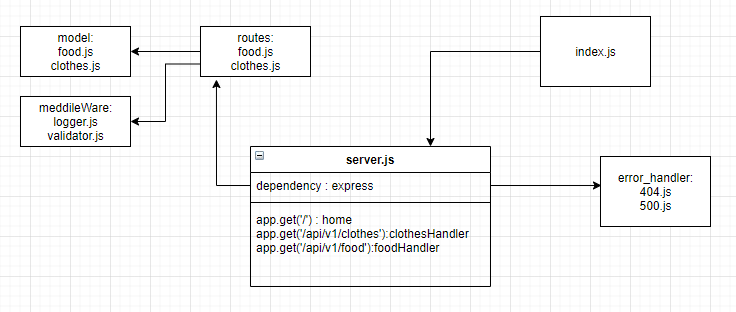

# basic-api-server

## Deployment Test
Author: Anwar Abbass
[tests report](https://github.com/AnwarAbbass/basic-api-server/runs/2645341638?check_suite_focus=true
)
[heroku](https://basic-api-server-anwar.herokuapp.com/)

## Setup
`.env` requirements
`cors`  requirements
`dotenv`  requirements
`express`  requirements
`morgan`  requirements
`uuid`  requirements
`jest`  requirements
`supertest`  requirements
PORT - Port Number

## Running the app
- npm start
   - Endpoint: /
Returns Object

{
  you are in the home page
}

  - Endpoint: /api/v1/food/

Returns Object
```
localhost:3000/api/v1/food/

{
    "id": "c89686d4-d4cd-4410-943c-dde2ef133b85",
    "data": {
        "name": "burgger",
        "price": "7JD"
    }
}
```
  - Endpoint: /api/v1/clothes/

Returns Object
```
{
    "id": "c89686d4-d4cd-4410-943c-dde2ef133b85",
    "data": {
        "name": "Dress",
        "price": "7JD"
    }
}
```

Tests
Unit Tests: npm run test


File                | % Stmts | % Branch | % Funcs | % Lines | Uncovered Line #s
--------------------|---------|----------|---------|---------|-------------------
All files           |   98.21 |       75 |   93.55 |   99.04 |
 src                |   91.67 |      100 |      50 |   95.45 |
  server.js         |   91.67 |      100 |      50 |   95.45 | 34
 src/error-handlers |     100 |      100 |     100 |     100 |
  404.js            |     100 |      100 |     100 |     100 |
  500.js            |     100 |      100 |     100 |     100 |
 src/middleware     |     100 |      100 |     100 |     100 |
  logger.js         |     100 |      100 |     100 |     100 |
 src/models         |     100 |       75 |     100 |     100 |
  clothes.js        |     100 |       75 |     100 |     100 | 35
  food.js           |     100 |       75 |     100 |     100 | 33
 src/routes         |     100 |      100 |     100 |     100 |
  clothes.js        |     100 |      100 |     100 |     100 |
  food.js           |     100 |      100 |     100 |     100 |

<br>

Test Suites: 2 passed, 2 total
Tests:       14 passed, 14 total
Snapshots:   0 total
Time:        51.896 s

[github test]()

Lint Tests: npm run lint
UML


